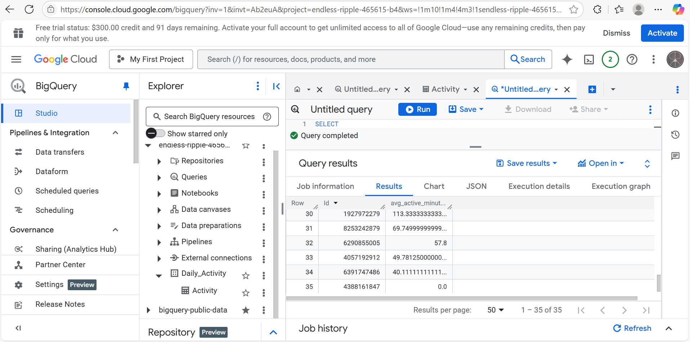

# GDA_Capstone_Bellabeat
Author: Ryan C   
Date: 7/8/2025  

This is a case study on Bellabeat for the Google Data Analytics Capstone project
The case study follows the six step data analysis process:

### ❓ Ask
### 💻 Prepare
### 🛠 Process
### 📊 Analyze
### 📋 Share
### 🧗‍♀️ Act 

# Scenario
You are a junior data analyst working on the marketing analyst team at Bellabeat, a high-tech manufacturer of health-focused
 products for women. Bellabeat is a successful small company, but they have the potential to become a larger player in the
 global sma device market. Urška Sršen, cofounder and Chief Creative O cer of Bellabeat, believes that analyzing sma
 device tness data could help unlock new growth oppo unities for the company. You have been asked to focus on one of
 Bellabeat’s products and analyze sma device data to gain insight into how consumers are using their sma devices. The
 insights you discover will then help guide marketing strategy for the company. You will present your analysis to the Bellabeat
 executive team along with your high-level recommendations for Bellabeat’s marketing strategy 
 Characters and products 
 
 **● Characters**
 
 **○ UrškaSršen:** Bellabeat’s cofounder and Chief Creative Officer 
 
 **○ SandoMur:** Mathematician and Bellabeat’s cofounder; key member of the Bellabeat executive team 
 
 **○ Bellabeat marketing analytics team:** A team of data analysts responsible for collecting, analyzing, and repo ing
 data that helps guide Bellabeat’s marketing strategy. You joined this team six months ago and have been busy
 learning about Bellabeat’’s mission and business goals — as well as how you, as a junior data analyst, can help
 Bellabeat achieve them. 
 
 **● Products** 
 
 **○ Bellabeat app:** The Bellabeat app provides users with health data related to their activity, sleep, stress,
 menstrual cycle, and mindfulness habits. This data can help users be er understand their current habits and
 make healthy decisions. The Bellabeat app connects to their line of sma wellness products. 
 
 **○ Leaf:** Bellabeat’s classic wellness tracker can be worn as a bracelet, necklace, or clip. The Leaf tracker connects
 to the Bellabeat app to track activity, sleep, and stress. 
 
 **○ Time:** Thiswellness watch combines the timeless look of a classic timepiece with sma technology to track user
 activity, sleep, and stress. The Time watch connects to the Bellabeat app to provide you with insights into your
 daily wellness. 
 
**○ Spring:** This is a water bo le that tracks daily water intake using sma technology to ensure that you are
 appropriately hydrated throughout the day. The Spring bo le connects to the Bellabeat app to track your
 hydration levels. 
 
 **○ Bellabeat membership:** Bellabeat also o ers a subscription-based membership program for users.
 Membership gives users 24/7 access to fully personalized guidance on nutrition, activity, sleep, health and
 beauty, and mindfulness based on their lifestyle and goals. 

  ---------------------------------------------------------------------------------------------------------------------------------------------------
  ----------------------------------------------------------------------------------------------------------------------------------------------------

 ### **In BigQuery, I began by searching some basic information and initial findings such as number of unique IDs, total steps, and avg active minutes:**  

  -----------------------------------------------------------------------------------------------------------------------------------------

 ## TOTAL UNIQUE IDS

 

------------------------------------------------------------------------------------------------------------------------------------------------------

----------------------------------------------------------------------------------------------------------------------------------------------------
------------------------------------------------------------------------------------------------------------------------------------------------------
## TOTAL STEPS 

  

 ---------------------------------------------------------------------------------------------------------------------------------------------------
   
 
 ---------------------------------------------------------------------------------------------------------------------------------------------------
 ----------------------------------------------------------------------------------------------------------------------------------------------------

  ## AVG ACTIVE MINUTES 

  
   

 --------------------------------------------------------------------------------------------------------------------------------------------------
  
  
